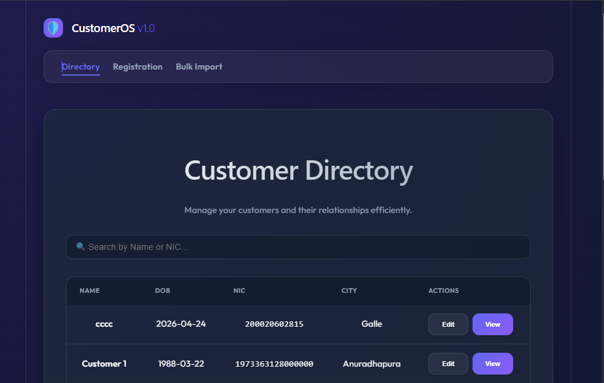

# Customer Management System

A production-ready Customer Management System built with Spring Boot, React, and MariaDB.

(screenshots/CMS2.png)(screenshots/CMS3.png)

## Features
- Create, Update, View Customers.
- Bulk Upload from Excel (supports up to 1,000,000 records asynchronously).
- Complex relationships: Multiple mobiles, multiple addresses, and family members (other customers).
- Master Data: Cities and Countries managed in separate tables.
- Pagination for large datasets.

## Technologies
- **Backend**: Java 8, Spring Boot 2.7.x, Spring Data JPA, Spring JDBC, Maven, EasyExcel.
- **Frontend**: React JS, Axios, Vite, Vanilla CSS.
- **Database**: MariaDB.
- **Testing**: JUnit 5, AssertJ.

## Prerequisites
- JDK 8 or higher.
- Maven 3.6+.
- Node.js 16+.
- MariaDB running on `localhost:3306`.
- Create a database named `customer_db`.

## Setup Instructions

### Database
1. Connect to your MariaDB instance.
2. Run the DDL script found in `backend/src/main/resources/schema.sql`.
3. Run the DML script found in `backend/src/main/resources/data.sql`.

### Backend
1. Navigate to the `backend` folder.
2. Update `src/main/resources/application.properties` with your MariaDB username and password.
3. Run the application:
   ```bash
   mvn spring-boot:run
   ```
4. The API will be available at `http://localhost:8080`.

### Frontend
1. Navigate to the `frontend` folder.
2. Install dependencies:
   ```bash
   npm install
   ```
3. Run the development server:
   ```bash
   npm run dev
   ```
4. Access the web interface at `http://localhost:5173`.

## Bulk Upload Format
The Excel file should have the following headers:
- `Name`
- `Date of Birth` (Format: YYYY-MM-DD)
- `NIC` (Unique identifier)

Processing is asynchronous to handle very large files (up to 1M rows) without timing out.
